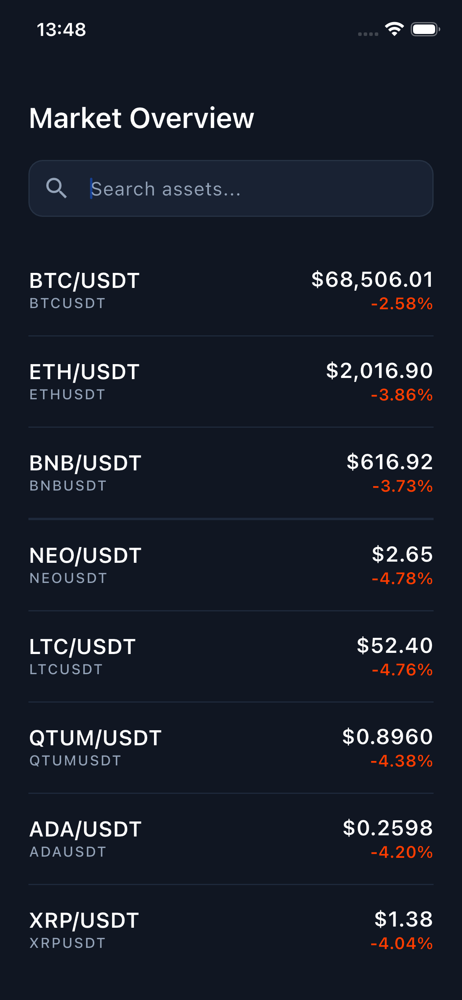
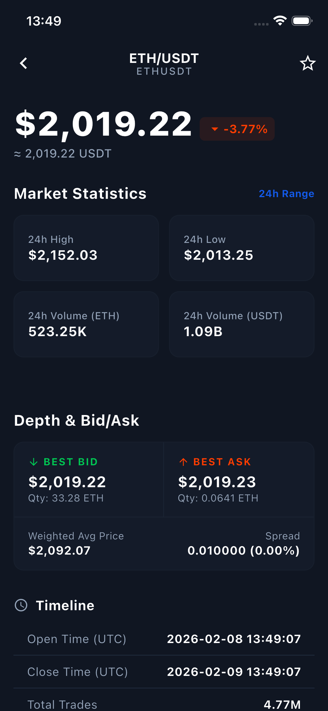

# Crypto Market App

Flutter tabanlı kripto para piyasası takip uygulaması.


## 🏗️ Mimari

**MVVM + Provider + GetIt**

```
lib/
├── app/
│   ├── const/          # Sabitler (AppColor, AppString)
│   ├── get_it/         # Dependency Injection setup
│   ├── router/         # Routing yapılandırması (go_router)
│   ├── theme/          # Tema ayarları (AppTheme)
│   └── util/           # Yardımcı sınıflar (NavigationHelper)
├── data/
│   ├── models/         # Data modelleri (TickerModel)
│   ├── repository/     # Data source yönetimi
│   └── services/       # API & WebSocket servisleri
└── presentation/
    ├── market/
    │   ├── view/       # Market List UI
    │   └── viewmodel/  # Market List business logic
    └── market_detail/
        ├── view/       # Detail UI
        └── viewmodel/  # Detail business logic
```

**Katman Açıklamaları:**
- **app/**: Uygulama geneli yapılandırma (DI, routing, theme, constants)
- **data/**: Veri katmanı (model, repository, API/WebSocket servisleri)
- **presentation/**: UI katmanı (ekranlar ve ViewModel'ler)

### State Management
- **Provider**: Reactive state yönetimi
- **GetIt**: Dependency Injection

### Routing
- **go_router**: Declarative routing ve deep linking

## 🔑 Önemli Teknik Yaklaşım

### Hybrid Data Fetching Strategy

**Market List (Ana Sayfa)**
```
1. REST API → İlk yükleme (hızlı başlangıç)
2. WebSocket → Gerçek zamanlı güncelleme
```
**Neden?** Uygulama açılışında kullanıcı hemen veri görür, ardından WebSocket ile canlı güncellemeler başlar.

**Market Detail (Detay Sayfası)**
```
WebSocket only → Direkt gerçek zamanlı veri
```
**Neden?** Tek bir coin için WebSocket bağlantısı yeterli ve daha performanslı.

### Teknik Kararlar

| Karar | Sebep |
|-------|-------|
| MVVM | UI/Business logic ayrımı, test edilebilirlik |
| Provider | Native Flutter desteği, minimal boilerplate |
| GetIt | Compile-time safety, servis locator |
| REST + WebSocket | Hızlı başlangıç + gerçek zamanlı veri |
| Repository Pattern | Data source soyutlaması |

## 📦 Paketler

- `provider` - State management
- `get_it` - DI
- `go_router` - Routing
- `web_socket_channel` - WebSocket bağlantısı
- `http` - REST API

## 🎯 Varsayımlar

- Dark theme varsayılan
- Mobil öncelikli tasarım
- API endpoint'leri önceden yapılandırılmış
- WebSocket otomatik reconnect destekli


<div style="display:flex; gap:16px;">
  
  
</div>